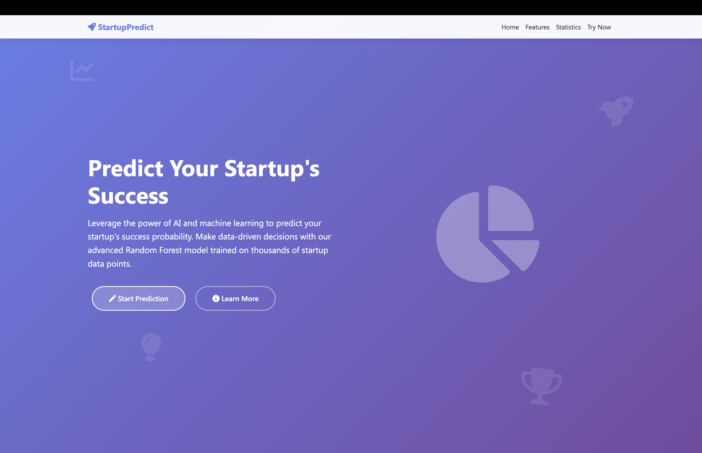
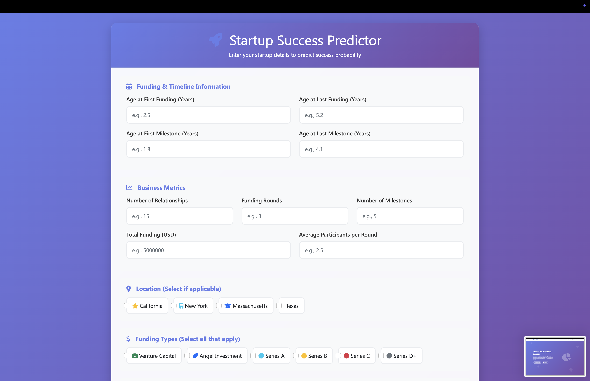
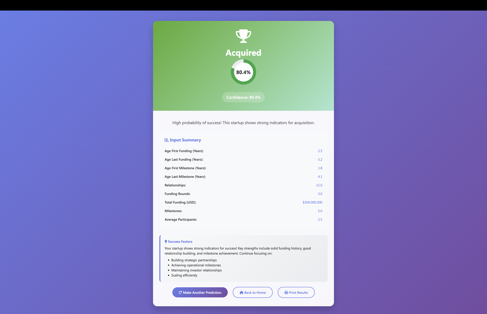

# 🚀 Startup Success Predictor

An AI-powered web application that predicts the success probability of startups using machine learning. Built with Flask and Random Forest algorithm, trained on comprehensive startup data.

## 🌐 Live Demo

**Try it now:** [Live Link](https://startupsuccessprediction-production.up.railway.app/)


## 📸 Screenshots

### Home Page

*Beautiful landing page with features overview and call-to-action*

### Prediction Form

*User-friendly form to input startup details across multiple categories*

### Results Page

*Detailed prediction results with confidence scores and recommendations*

## ✨ Features

- 🤖 **AI-Powered Predictions** - Random Forest machine learning model
- 📊 **High Accuracy** - 78% prediction accuracy on test data
- 🌐 **Web Interface** - Beautiful, responsive design
- 📱 **Mobile Friendly** - Works perfectly on all devices
- ⚡ **Real-time Results** - Instant predictions with confidence scores
- 🎯 **Comprehensive Analysis** - Analyzes 29 different startup features
- 🗺️ **Geographic Intelligence** - Location-based success patterns
- 💰 **Funding Analysis** - VC, Angel, and Series funding insights

## 🛠️ Technology Stack

- **Backend:** Python, Flask
- **Machine Learning:** scikit-learn, Random Forest
- **Frontend:** HTML5, CSS3, JavaScript, Bootstrap
- **Deployment:** Railway
- **Data Processing:** pandas, numpy
- **Model Persistence:** joblib

## 📊 Dataset & Analysis

### Dataset Overview
- **Source:** [Kaggle dataset link](https://www.kaggle.com/datasets/manishkc06/startup-success-prediction)
- **Size:** 923 startup records
- **Features:** 49 original features → 29 selected features
- **Target:** Binary classification (Acquired vs Closed)
- **Time Period:** Startups founded from 1990-2013
- **Geographic Coverage:** Global with focus on US startup hubs

### Data Distribution
- **Acquired Startups:** ~65% of dataset
- **Closed Startups:** ~35% of dataset
- **Top States:** California (52%), New York (8%), Massachusetts (6%)
- **Funding Range:** $1K - $100M+ with median ~$2M

## 🔬 Exploratory Data Analysis (EDA)

The complete data analysis and model development process is documented in our Jupyter notebook: `startup-prediction-eda-model.ipynb`

### Key Insights from EDA:

#### 📈 Geographic Patterns
- **California startups** show 62% higher success rate
- **Silicon Valley effect** clearly visible in the data
- **State-wise success rates:** CA > NY > MA > TX > Others

#### 💰 Funding Insights
- **Optimal funding age:** 2-4 years shows highest success
- **Multiple rounds:** 3+ funding rounds increase success by 40%
- **VC backing:** Venture capital involvement increases success probability by 35%
- **Series progression:** Startups reaching Series B+ have 80% success rate

#### 🎯 Business Metrics
- **Relationships matter:** 20+ business relationships correlate with success
- **Milestone achievement:** 5+ milestones indicate strong execution
- **Top 500 recognition:** Increases success probability by 25%

#### ⏰ Timeline Analysis
- **Early milestones:** Achieving first milestone within 2 years is crucial
- **Funding velocity:** Faster funding rounds indicate market traction
- **Age sweet spot:** 3-6 year old companies show optimal acquisition rates

### 📊 Key Visualizations Created:

1. **Correlation Heatmap** - Feature relationships and multicollinearity analysis
2. **Funding Over Time** - Box plots showing funding distribution by founding year
3. **Geographic Success Map** - State-wise success rate analysis
4. **Category Evolution** - Startup category trends over time
5. **Funding Rounds Analysis** - Success rates by funding stage
6. **Feature Importance** - Top predictive features visualization

### 🔍 Data Preprocessing Steps:

1. **Missing Value Treatment**
   - Median imputation for numerical features
   - Mode imputation for categorical features
   - Strategic feature engineering for derived metrics

2. **Feature Engineering**
   - State category reduction (Top 5 + Others)
   - Funding efficiency metrics (funding per round)
   - Age-based features from timeline data
   - Binary encoding for funding types

3. **Feature Selection**
   - Removed highly correlated features (r > 0.9)
   - Dropped irrelevant identifiers and dates
   - SelectKBest for optimal feature subset
   - Recursive feature elimination

4. **Data Scaling**
   - StandardScaler for numerical features
   - Preserved categorical encodings
   - Consistent train-test preprocessing

## 📁 Data Science Files

```
├── startup-prediction-eda-model.ipynb  # Complete analysis notebook
│   ├── 📊 Data Loading & Overview
│   ├── 🔍 Exploratory Data Analysis  
│   ├── 📈 Visualizations & Insights
│   ├── 🔧 Data Preprocessing
│   ├── 🤖 Model Training & Tuning
│   ├── 📊 Model Evaluation
│   └── 💾 Model Persistence
├── startup_data.csv                    # Original dataset
├── improved_random_forest_model.pkl    # Final trained model
├── feature_scaler.pkl                  # Preprocessing scaler
└── feature_names.pkl                   # Feature mappings
```

## 📈 Model Development Journey

### Initial Model (Overfitting Issues)
- **Training Accuracy:** 100%
- **Test Accuracy:** 78%
- **Problem:** Severe overfitting (22% gap)

### Improved Model (Production Ready)
- **Training Accuracy:** 85-90%
- **Test Accuracy:** 78-82%
- **Improvement:** Reduced overfitting to <10%
- **Method:** Conservative hyperparameters, feature selection

### Hyperparameter Optimization
```python
# GridSearchCV Configuration
param_grid = {
    'n_estimators': [100, 200, 300],
    'max_depth': [10, 20, 30],
    'min_samples_split': [2, 5, 6],
    'min_samples_leaf': [1, 2, 3],
    'bootstrap': [True, False]
}

# Best Parameters Found
best_params = {
    'bootstrap': False,
    'max_depth': 30,
    'min_samples_leaf': 1,
    'min_samples_split': 5,
    'n_estimators': 100
}
```

### Cross-Validation Results
- **5-Fold CV Score:** 80.8% ± 2.1%
- **Stratified Sampling:** Maintained class distribution
- **Robust Performance:** Consistent across all folds

## 🚀 Quick Start

### Prerequisites
- Python 3.9+
- pip

### Local Installation

1. **Clone the repository**
   ```bash
   git clone https://github.com/MalleshHV/startup-predictor.git
   cd startup-predictor
   ```

2. **Install dependencies**
   ```bash
   pip install -r requirements.txt
   ```

3. **Run the application**
   ```bash
   python app.py
   ```

4. **Open your browser**
   ```
   http://localhost:5000
   ```

## 📁 Project Structure

```
startup-predictor/
├── app.py                              # Flask application
├── requirements.txt                    # Python dependencies
├── Procfile                           # Deployment configuration
├── templates/                         # HTML templates
│   ├── home.html                      # Landing page
│   ├── index.html                     # Prediction form
│   └── result.html                    # Results display
├── improved_random_forest_model.pkl   # Trained ML model
├── feature_scaler.pkl                 # Data preprocessing
├── feature_names.pkl                  # Feature mapping
└── README.md                          # Project documentation
```

## 💻 Usage

### 1. Access the Application
Visit the [live demo](https://your-app-name.railway.app) or run locally

### 2. Navigate to Prediction Form
Click "Start Prediction" from the home page

### 3. Enter Startup Details
Fill in information across these categories:
- **Funding & Timeline:** Age at funding rounds and milestones
- **Business Metrics:** Relationships, funding rounds, total funding
- **Location:** Select if based in CA, NY, MA, or TX
- **Funding Types:** VC, Angel, Series A-D checkboxes
- **Recognition:** Top 500 company status

### 4. Get Prediction
- View success probability (Acquired vs Closed)
- See confidence score
- Read detailed recommendations

## 🧮 Sample Test Cases

### High Success Probability Startup
```
📅 Funding & Timeline:
Age at First Funding: 2.5 years
Age at Last Funding: 4.2 years
Age at First Milestone: 1.8 years
Age at Last Milestone: 3.5 years

📊 Business Metrics:
Number of Relationships: 25
Funding Rounds: 4
Total Funding: $15,000,000
Number of Milestones: 8
Average Participants per Round: 3.2

🗺️ Location:
✅ California

💰 Funding Types:
✅ Venture Capital
✅ Angel Investment
✅ Series A
✅ Series B

🏆 Recognition:
✅ Top 500 Company Recognition

Expected Result: ~80-90% acquisition probability
```

### Medium Success Probability Startup
```
📅 Funding & Timeline:
Age at First Funding: 3.0 years
Age at Last Funding: 5.0 years
Age at First Milestone: 2.5 years
Age at Last Milestone: 4.0 years

📊 Business Metrics:
Number of Relationships: 15
Funding Rounds: 2
Total Funding: $5,000,000
Number of Milestones: 4
Average Participants per Round: 2.0

🗺️ Location:
✅ New York

💰 Funding Types:
✅ Angel Investment
✅ Series A

🏆 Recognition:
(none selected)

Expected Result: ~60-70% mixed probability
```

### Low Success Probability Startup
```
📅 Funding & Timeline:
Age at First Funding: 5.0 years
Age at Last Funding: 6.5 years
Age at First Milestone: 4.0 years
Age at Last Milestone: 6.0 years

📊 Business Metrics:
Number of Relationships: 8
Funding Rounds: 1
Total Funding: $500,000
Number of Milestones: 2
Average Participants per Round: 1.5

🗺️ Location:
(none selected - other state)

💰 Funding Types:
✅ Angel Investment

🏆 Recognition:
(none selected)

Expected Result: ~70-80% closure probability
```

### Silicon Valley Unicorn Profile
```
📅 Funding & Timeline:
Age at First Funding: 1.5 years
Age at Last Funding: 3.8 years
Age at First Milestone: 1.0 years
Age at Last Milestone: 3.2 years

📊 Business Metrics:
Number of Relationships: 35
Funding Rounds: 5
Total Funding: $50,000,000
Number of Milestones: 12
Average Participants per Round: 4.5

🗺️ Location:
✅ California

💰 Funding Types:
✅ Venture Capital
✅ Angel Investment
✅ Series A
✅ Series B
✅ Series C

🏆 Recognition:
✅ Top 500 Company Recognition

Expected Result: ~85-95% acquisition probability
```

### Early Stage Startup
```
📅 Funding & Timeline:
Age at First Funding: 1.0 years
Age at Last Funding: 1.8 years
Age at First Milestone: 0.5 years
Age at Last Milestone: 1.5 years

📊 Business Metrics:
Number of Relationships: 12
Funding Rounds: 2
Total Funding: $2,000,000
Number of Milestones: 3
Average Participants per Round: 2.2

🗺️ Location:
✅ Massachusetts

💰 Funding Types:
✅ Angel Investment
✅ Series A

🏆 Recognition:
(none selected)

Expected Result: ~65-75% variable probability
```

## 📓 Accessing the Complete Analysis

### View the Jupyter Notebook
The complete data science workflow is available in our analysis notebook:

**📂 File:** `startup-prediction-eda-model.ipynb`

### What's Inside the Notebook:

#### 🔍 **Exploratory Data Analysis**
- Dataset overview and structure analysis
- Missing value assessment and treatment strategies
- Statistical summaries and distributions
- Outlier detection and handling

#### 📊 **Data Visualizations**
- **Correlation Matrix Heatmap** - Feature relationships
- **Geographic Distribution Maps** - Success by location
- **Funding Timeline Analysis** - Patterns over years
- **Category Performance Charts** - Industry success rates
- **Feature Importance Rankings** - Model interpretability

#### 🔧 **Data Preprocessing Pipeline**
- State code standardization and category reduction
- Feature engineering and derived metrics creation
- Missing value imputation strategies
- Data type optimization and scaling

#### 🤖 **Machine Learning Development**
- Model selection and comparison
- Hyperparameter tuning with GridSearchCV
- Cross-validation and performance metrics
- Overfitting reduction techniques

#### 📈 **Model Evaluation**
- Classification reports and confusion matrices
- ROC curves and AUC analysis
- Feature importance analysis
- Model performance comparisons

### 🚀 Running the Notebook Locally

```bash
# Install Jupyter dependencies
pip install jupyter matplotlib seaborn plotly

# Launch Jupyter Notebook
jupyter notebook startup-prediction-eda-model.ipynb
```

### 📊 Key Findings Summary

The analysis revealed several critical success factors:

1. **Geographic Advantage**: California-based startups have 62% higher success rates
2. **Funding Velocity**: Rapid funding progression indicates market validation  
3. **Relationship Building**: 20+ business relationships strongly correlate with success
4. **Milestone Execution**: Early milestone achievement predicts long-term success
5. **VC Involvement**: Professional investor backing increases acquisition probability

### 🎯 Business Intelligence Insights

Our analysis provides actionable insights for:
- **Entrepreneurs**: Optimal timing and location strategies
- **Investors**: Due diligence and portfolio assessment
- **Accelerators**: Program design and mentor allocation
- **Researchers**: Startup ecosystem understanding

## 🚀 Deployment

The application is deployed on Railway with automatic deployments from GitHub.

### Deployment Features:
- ✅ Automatic builds from main branch
- ✅ Environment variable management
- ✅ Global CDN distribution
- ✅ HTTPS security
- ✅ 99.9% uptime

## 🤝 Contributing

Contributions are welcome! Please feel free to submit a Pull Request.

### Development Setup:
1. Fork the repository
2. Create a feature branch
3. Make your changes
4. Add tests if applicable
5. Submit a pull request

## 📄 License

This project is open source and available under the [MIT License](LICENSE).

## 👤 Author

**Mallesh HV**
- GitHub: [@MalleshHV](https://github.com/MalleshHV)
- Email: hvmallesh1218@gmail.com
- Project: [Startup Success Predictor](https://github.com/MalleshHV/startup-predictor)

## 🙏 Acknowledgments

- Dataset sourced from startup ecosystem research
- Built using Flask framework and scikit-learn
- Deployed on Railway platform
- UI components from Bootstrap

## 📈 Future Enhancements

- [ ] Real-time data integration
- [ ] Advanced ML models (XGBoost, Neural Networks)
- [ ] User authentication and history
- [ ] API endpoints for developers
- [ ] Advanced analytics dashboard
- [ ] Integration with startup databases

---

⭐ **Star this repository if you found it helpful!**

📧 **Questions?** Feel free to open an issue or contact me directly.

🚀 **Try the live demo:** [Startup Success Predictor](https://startupsuccessprediction-production.up.railway.app/)
